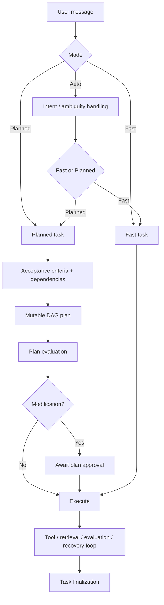

# Architecture & Pipeline

Loa is a stateful coding agent whose control layer is implemented in `internal/agent`. The engine separates model-backed decisions, tool execution, persisted task state, memory retrieval, evaluation, recovery, and user intervention instead of treating a task as one open-ended chat/tool loop.

This document describes the current `main` implementation. The names below refer to the primitives and state transitions used by the engine today.

## 1. Execution Model

A single active task is progressed through a serialized control flow. Individual plan steps are not executed in parallel. The engine may run the active task from a goroutine owned by the server, and Loa also has background components such as the filesystem watcher, but plan-step reasoning and mutations are coordinated through the task state rather than being executed as independent parallel agents.

Model-backed operations are expressed as **Primitives**. Tools are separate: an `ExecuteStep` primitive can request a tool call, after which the Tool Manager performs the requested filesystem/process operation and returns a result to the engine.

The high-level flow is:

## 2. Auto, Fast, and Planned Modes

### Auto Mode

In Auto Mode, Loa runs its intent/ambiguity path before choosing the execution route. The user can also select Fast or Planned explicitly, bypassing that automatic routing decision.

### Fast Mode

Fast Mode does **not** mean a single prompt/response call. The current engine creates one synthetic plan step named `Execute Fast Track` and runs it through Loa's normal execution machinery.

Fast Mode skips:

- formal acceptance-criteria generation,
- initial multi-step DAG planning,
- the modifying-plan approval gate,
- structural replanning of a multi-step DAG,
- the Planned Mode final acceptance audit.

It still has tool use, retrieval, execution decisions, task state, memory finalization, and the normal model calls required by those mechanisms.

### Planned Mode

Planned Mode creates acceptance criteria, maps criteria dependencies, generates a DAG, and evaluates that plan before execution. A modifying Planned task transitions to an approval state before Loa starts mutating the project.

The plan is mutable. During execution, steps can be decomposed, repaired, retried, or replaced through replanning when the engine determines that the existing remainder is no longer adequate.

## 3. The DAG Is Also Context Topology

A dependency edge is not only an ordering constraint.

When the context builder prepares a model request for a step, it injects completed `StepResult` values from that step's direct `depends_on` dependencies as **direct prerequisites**. The engine can also add a configurable tail of recent step-result breadcrumbs.

This means changing the DAG can change both:

1. which step is eligible to run next, and
2. which completed results are routed directly into that step's prompt context.

The full conversation/task history is not blindly appended to every request. See [Memory System](memory_system.md) for the current context-composition rules.

## 4. Planned Step Lifecycle

A Planned Mode step is prepared and then enters an execution loop. Depending on the step and current state, preparation can include evaluation, target tagging, or decomposition.

During the execution loop, the `ExecuteStep` primitive can request one of several actions, including:

- a registered tool call,
- semantic memory retrieval,
- previous task-step information,
- clarification from the user,
- or completion of the current step.

The Tool Manager executes requested tools separately from the primitive itself.

### Mutating Actions

For mutating tools, the engine normally performs additional control work around the call. In the current implementation, mutating tools other than `execute_process` can be preceded by `FormulateHypothesis` and followed by result evaluation.

This distinction matters: `execute_process` is classified as mutating for permissions, but it is explicitly excluded from the hypothesis/result-evaluation branch used for other mutating tools. `execute_shell` is not excluded.

### Result Evaluation

`EvaluateStepResult` can return more than a binary success/failure result. Current statuses include outcomes such as:

- success,
- partial,
- verification required,
- needs more information,
- plan invalid,
- failed.

A failed or incomplete result can be routed through recovery logic. The engine can distinguish retry, repair, clarification, rollback/recovery, or replanning rather than applying one generic retry loop.

After repeated unsuccessful reflection/recovery attempts, the engine can invoke `CritiqueApproach` before continuing.

## 5. Strict and Dynamic Evaluation

The configuration field is `evaluation_mode`. The current UI presents two choices:

- **Strict** (stored as `Immediate`),
- **Dynamic** (stored as `Dynamic`).

In Dynamic mode, a mutating action may be allowed to continue without the full immediate evaluation path. The engine counts consecutive blind actions. When the configured `blind_action_threshold` is reached, it invokes `AssessBlindExecution` as a decision point. That primitive can require evaluation or allow execution to continue.

This is a threshold-triggered control primitive. It is **not** a continuously running background supervisor watching every action.

## 6. Completing a Step

When a normal Planned step completes, the engine currently performs several pieces of bookkeeping:

1. generates a step artifact,
2. extracts a structured `StepResult`,
3. refreshes the active task context from the previous task context plus the new completed result and acceptance criteria,
4. stores the completed result in task state,
5. updates memory-related state used by later retrieval/finalization.

`RefreshTaskContext` is therefore part of normal step completion. It is not only an emergency operation triggered by a full context window.

The persisted step result contains structured information such as the step summary, facts/decisions, files read or changed, artifact references, and tool-call identifiers.

## 7. Final Verification and Synthesis

Planned tasks have a separate final verification phase. The engine uses an iterative evaluation loop with read-only tooling to check the completed work against the task's acceptance criteria. That loop is bounded by the configured planning-depth limit.

After verification, Loa synthesizes the task result and writes the final response artifact.

Fast Mode does not run that Planned Mode acceptance-audit path. It synthesizes the Fast task result and then runs task-memory finalization.

## 8. Loop and Planning Bounds

Two settings are easy to misread from their labels:

### `max_execution_loops`

This value is used to bound internal execution loops, including the per-step execution/recovery loop. It should not be interpreted as one monotonically increasing counter for every operation across the entire task.

### `max_plan_depth`

This setting is used by several planning-related bounds in the current engine, including plan/replan/decomposition and final iterative-audit paths. It is broader than a simple visual DAG-depth limit.

When a run cannot safely continue, the engine can move the task to a paused/manual-intervention state instead of discarding the persisted task state.

## 9. User Intervention

If the user sends a message while a task is running, Loa queues it as an intervention.

`PrimitiveIntervention` interprets the new guidance in the context of the active task and can update facts, decisions, constraints, or open issues.

For Planned Mode, an intervention can trigger replanning of the remaining DAG. Fast Mode has no multi-step DAG remainder to structurally replan, so new guidance is incorporated into the continuing Fast execution instead.

## 10. Pause, Resume, and Restart

Task/session state is persisted under `.loa/`.

When persisted session state is loaded after a restart, a task that had been stored as `running` is reset to `paused`. This prevents a dead process from leaving the UI with a permanently running task state. The user can then inspect the state and resume it.

Manual pause also cancels the active run and records the task as paused. Error paths can pause the task while preserving the DAG, tool records, messages, and other persisted state needed for inspection and recovery.

## 11. Project Crawling and JIT Reconciliation

Loa's project memory is kept current through two related mechanisms:

1. **Crawler:** indexes unindexed source chunks and generates structural memories.
2. **Filesystem watcher:** detects project-file changes and marks affected files stale.

The watcher does not immediately regenerate every memory item at the exact moment a file changes. It debounces filesystem events and marks files stale. At engine reconciliation boundaries, stale file memories are removed, the code index is rebuilt as needed, and the crawler regenerates missing structural memories.

The crawler itself is synchronous with respect to Loa's model calls: it locks the engine's inference path while generating Narrative Frames/keywords for code chunks. This avoids overlapping crawler inference with task inference, but it also means crawling can be inference-intensive.

See [Memory System](memory_system.md) for the crawler's current storage model.
