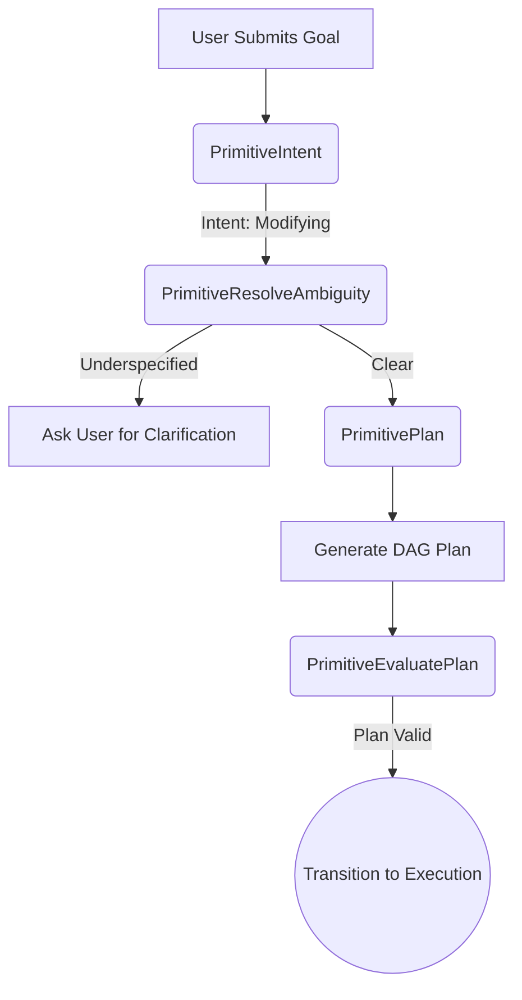
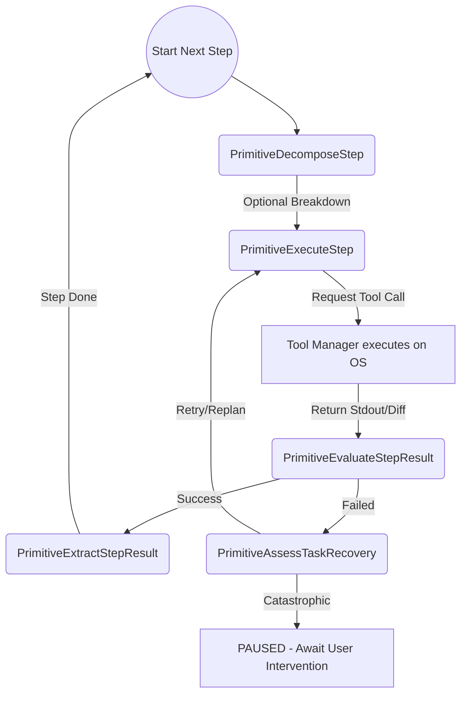

# Architecture & Pipeline

Loa operates as a strict state-machine engine designed to manage autonomous coding workflows. Its core design philosophy avoids unstructured, open-ended "agentic loops"; instead, it enforces progression through a series of discrete, verifiable states known as **Primitives**.

## The Execution Engine

The engine (implemented in `internal/agent/engine.go`) continuously transitions between these Primitives. There is no parallel background execution of tasks—everything runs synchronously to ensure that state mutations (file writes, shell commands) maintain strict consistency and verifiable audit trails.

### Pipeline Composition

Loa utilizes two conceptual pipeline models, seamlessly woven together by the Engine:

#### 1. The Setup & Planning Pipeline
When a user submits a goal, the engine executes a strict, sequential pipeline to gather context and structure the work before any mutating actions are allowed. 

The initial output of this pipeline is a **Mutable DAG** (Directed Acyclic Graph). Unlike a fixed plan, this DAG is expected to change as the agent learns the codebase. Changing the DAG changes both execution order and information flow (context topology).

#### 2. The Dynamic Execution Loop
Once a valid Directed Acyclic Graph (DAG) plan is generated, it transitions into the `PrimitiveExecuteStep` loop. This is a dynamic cycle where the agent handles individual steps safely.

## Loop Limits & Safety Bounds

To prevent runaway costs and infinite logic loops, Loa enforces a rigid constraint system:

- **Dynamic Evaluation & Background Supervisor:** When configured in `dynamic` evaluation mode, Loa can execute tightly coupled tasks quickly in sequence (blindly). However, a lightweight background supervisor LLM constantly monitors the execution log. If the supervisor detects the agent drifting off task, it can interrupt the blind execution and force a deep, strict evaluation before the `Max Execution Loops` or `Blind Action Threshold` is even reached.
- **Max Execution Loops:** A global configuration setting that acts as a circuit breaker. It tracks the total number of iterative operations (tool executions, reflections, replans) across an entire task session. 
- **The PAUSED State:** If the agent hits the `Max Execution Loops` threshold, the engine immediately halts and transitions to a PAUSED state. It suspends all background activity. From here, the user can manually inspect the session logs, tweak configurations, or provide manual guidance before choosing to resume or abort.

## Error Correction & Fallbacks

The engine does not blindly crash when a tool fails or an LLM hallucinates malformed JSON. It is built on the philosophy that **failure generates new knowledge rather than merely consuming retries.** It relies on specific primitives for self-correction:

- **Reflection (`PrimitiveEvaluateStepResult`):** Build success is not treated as semantic correctness. After a tool executes, the output is evaluated independently. It explicitly permits states like `partial` or `verification_required` to avoid premature completion.
- **Task Recovery (`PrimitiveAssessTaskRecovery`):** If a step fails, this primitive decides whether the problem needs a blind retry, more investigation, a local repair, or a structural change (rewiring) of the remaining DAG.
- **Structured Output Repair:** Malformed JSON gets deterministic repair where possible, followed by bounded model-based repair, ensuring orchestration glitches do not kill a 10-hour run.
- **Intervention (`PrimitiveIntervention`):** If the execution enters a catastrophic loop, the engine suspends to a manual-intervention state, preserving the DAG, memories, tool state, and artifacts for the user to inspect and resolve.

By treating error states as explicit Primitives rather than unhandled exceptions, the engine maintains context and stability even during complex refactors.

## JIT File System Reconciliation

While the Engine strictly controls mutations during execution, Loa respects that developers often work alongside the agent. The **JIT (Just-In-Time) Reconciliation** system uses a background File System Watcher to detect manual out-of-band changes to the codebase. 

When a developer edits, deletes, or renames a file in their IDE, the Watcher immediately invalidates the stale AST memory and triggers the crawler to re-index the affected files on the fly. This guarantees that Loa's internal semantic graph perfectly mirrors the actual physical filesystem at all times, without requiring manual restarts or full re-indexes.
