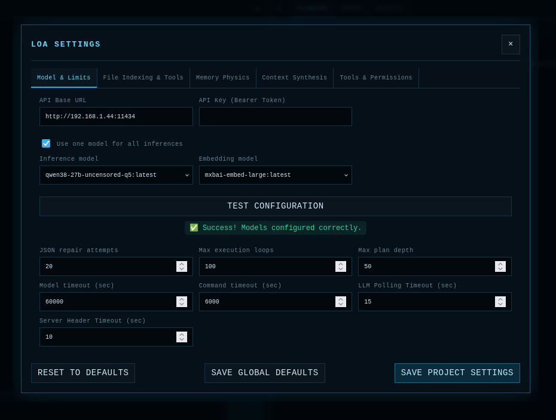
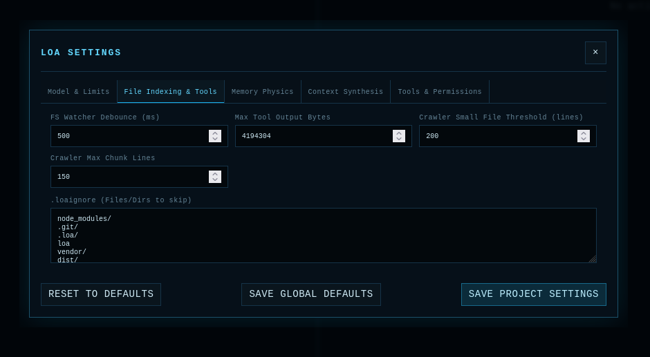
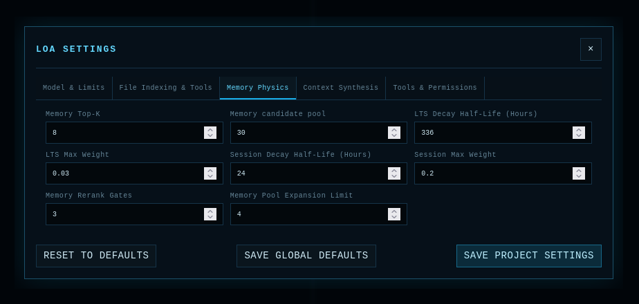
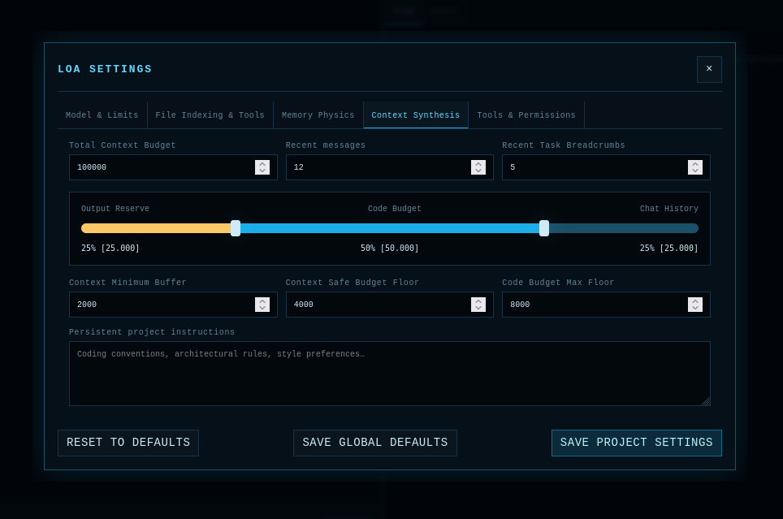
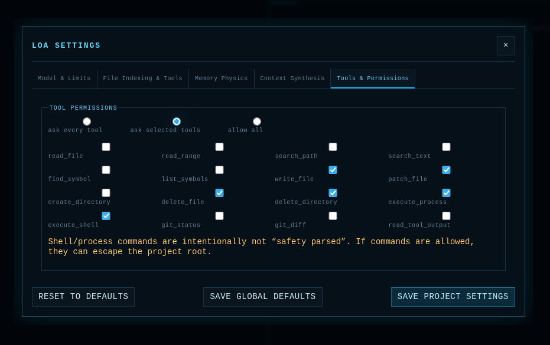

# Settings Reference Guide

Loa provides an extensive settings panel (accessible via the top navigation bar) to fine-tune its memory physics, indexing behavior, and model parameters. 

This guide breaks down each of the 5 configuration tabs to help you optimize Loa for your specific hardware and project size.

## 1. Model & Limits
*(Configure which models perform which roles, and set basic safety guardrails)*

This tab defines the foundational connection to your AI provider (e.g., Ollama).
- **API Base URL & Key:** The endpoint where your LLM is hosted.
- **Role-Specific Models:** Loa can route different types of cognitive tasks to different models. For example, you might want a massive, slow model for **Planning**, but a smaller, lightning-fast model for **Crawling** and **Executing**. 
- **Use one model for all inferences:** If checked, this forces Loa to use your primary model for all tasks, ignoring the individual dropdowns.
- **Embedding Model:** Defines the model used to vectorize your codebase for semantic search. **This must be a dedicated embedding model (e.g., `nomic-embed-text`)!**
- **Timeouts & Loops:** Set hard circuit-breakers to prevent the agent from getting stuck in an infinite loop or hanging indefinitely if your API server drops a connection.

## 2. File Indexing & Tools
*(Control how Loa reads and crawls your codebase)*

This tab controls the AST (Abstract Syntax Tree) engine and file crawling behaviors.
- **Use AST Search / AST Tool:** Toggle whether Loa is allowed to parse your code using Tree-sitter for structural searches (e.g., "find all functions that implement this interface").
- **Max File Size:** Files larger than this (in bytes) will be completely ignored during codebase indexing to prevent blowing up the search database.
- **Top-K Results:** When Loa searches the codebase, this determines the maximum number of file snippets returned in a single query. Keep this lower (e.g., 5-10) for smaller context windows.

## 3. Memory Physics
*(Tune the context compression algorithms)*

Because context windows are finite, Loa uses dynamic "Memory Physics" to forget old information and prioritize new information.
- **Max Context History Steps:** How far back in the DAG plan execution history should the agent remember? If set to 5, the agent will only see the exact terminal outputs and thought processes of the last 5 steps.
- **Target Compression Ratio:** When memories become too old, Loa uses an LLM to compress them into dense structural facts. This ratio (e.g., `0.3`) dictates how aggressively the text should be summarized.

## 4. Context Synthesis
*(Allocate your token budget)*

This is the most important tab for **Hardware Optimization**. It dictates exactly how the raw token budget is divided before being sent to the LLM.
- **Total Context Budget:** The absolute maximum number of tokens Loa will ever send to your inference model. If you have 32GB VRAM and a Qwen3.8 32B model, you might set this to `100000`.
- **Budget Sliders:** 
  - **Code Budget:** The percentage of the total budget reserved strictly for injecting file contents and AST structures.
  - **Chat History:** The percentage reserved for your conversation with the agent.
  - **Output Reserve:** The percentage reserved for the model's actual response. (Always leave at least 20-25% here so the model has room to write code!).
- **Recent Task Breadcrumbs:** The number of short summaries injected into the prompt representing the outcomes of previous steps (e.g., "[Step 4] Success: Compiled successfully").

## 5. Tools & Permissions
*(Control what the agent is allowed to do)*

This tab controls the permission model for when Loa wants to execute tools (like reading files, modifying code, or running terminal commands).
- **ask every tool:** The agent will pause and request manual approval for *every single tool call* it attempts to make.
- **ask selected tools:** You can explicitly choose which tools require manual approval using the checkbox grid (e.g., allow it to freely read files, but always ask before running a shell command or modifying a file).
- **allow all:** The agent runs fully autonomously without asking for permission for any tool.

When Loa pauses to ask for permission, a modal will appear showing exactly what tool it wants to use, the arguments it will pass, and its reasoning. From there, you can either approve the execution, or use the chat to send a steering message to adjust its plan!
