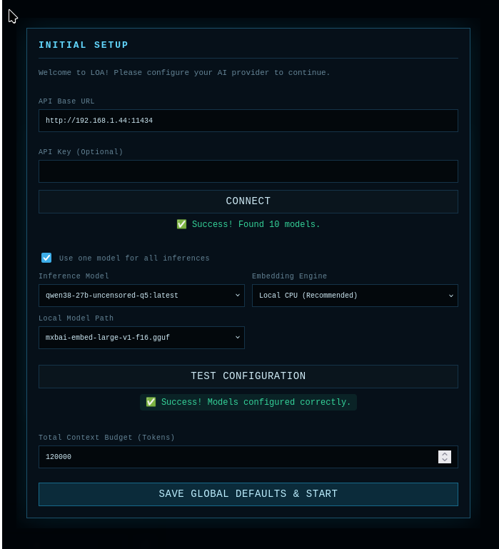
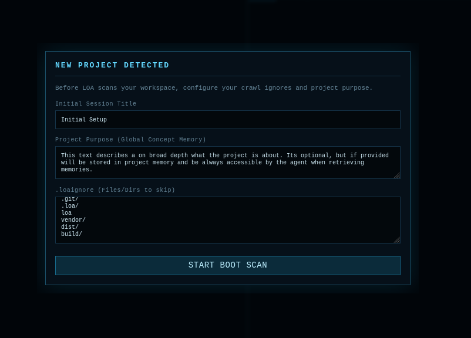

# Loa Usage Guide

Welcome to Loa. This guide will walk you through the day-to-day workflow of operating the agent, interacting with its UI, and writing effective prompts to ensure reliable execution.

## First-Time Setup

Before you can start chatting, you'll encounter two setup wizards to configure your environment.

### 1. The Initial Setup Wizard
*(Configure your LLM endpoints and test connections)*
For the beginning it's recommended to just choose a single model for all inferences and one for embeddings. Make sure to test the configuration before finishing the initial setup. Regarding the "Total Context Budget" you should provide an amount that fits within the buffer of your inference API service, and optimally is supported by the model you plan to choose for inference.

This wizard appears the very first time you launch Loa. Here you define your global API endpoint (e.g., `http://127.0.0.1:11434` for Ollama) and select the models Loa will use.
- **Tip:** You can click the **TEST CONFIGURATION** button at the bottom to ensure Loa can successfully reach your models. This is especially important to verify that you have selected a valid, dedicated embedding model (like `mxbai-embed-large`) for the Embedding Model slot since embedding is used for handling memories and internal searches.

### 2. The Project Setup Wizard
*(Configure project-specific boundaries)*

This wizard appears whenever Loa detects it is running in a new directory. 
- **Project Purpose:** Briefly explain what this repository is about. This gives the agent immediate baseline context.
- **.loaignore:** Define which directories the crawler should ignore during project indexing (e.g., `node_modules`, `vendor`, `.git`). This prevents massive dependency folders from polluting the search index, though the agent can still manually read specific files inside them if necessary. Loa provides sensible defaults automatically. Choose those carefully because once started loa will at least for once index the whole project and create AST information alongside narrative frames for each file which it later in process can use for cheap lookups.

---

## Hardware & Performance Settings

Depending on your local hardware (specifically VRAM), you may want to tweak Loa's memory physics for optimal performance. You can access these via the **Settings** modal in the UI. To properly configure this you need to know the configured amount of context buffer provided by your inference API and optimally the supported context buffer size of the inference model of your choice.

- **Low-End Setup (e.g., 16-24GB VRAM):** Keep the **Total Context Budget** around `40000` to `60000` tokens. In the *Context Synthesis* tab, you might want to keep the **Max Context History Steps** low (e.g., 4).
- **Medium Setup (e.g., ~32GB VRAM):** Keep the **Total Context Budget** around `100000` to `200000` tokens. In the *Context Synthesis* tab, you might want to keep the **Max Context History Steps** medium (e.g., 6-8).
- **High-End Setup (e.g., 64GB+ VRAM):** If you are running massive models with huge context windows, you can safely increase the **Total Context Budget** to `300000`+  tokens. You can also increase the **Max Context History Steps** (e.g., ~10) allowing the agent to remember much deeper conversational history during complex executions.

At the end of the day, the optimal values are completely dependent on your environment and use case.

> **⚙️ Advanced Configuration:** Loa features an extensive settings panel (accessible via the top navigation bar) containing 5 distinct tabs to fine-tune its memory physics, indexing behavior, and model parameters. For a deep-dive into how to optimize every single setting for your specific hardware and project size, please read the [Settings Reference Guide](settings_reference.md).

---

## The Web UI Overview

### 1. Chat Tab (The Command Center)
The Chat tab is where you interact directly with the agent.
- **Goal Submission:** Type your request here. The agent will analyze your intent and decide whether to reply conversationally or generate an execution plan to modify the codebase.
- **Interventions:** If the agent is currently executing a long-running plan and goes off track, you can type a new message here to intervene. The agent will pause, assess your new guidance, and optionally update its plan.

### 2. Inspect Pane (The Right Sidebar)
The Inspect Pane provides a deep look into the agent's internal state. It is divided into three primary top-level tabs: **SESSION**, **MEMORY**, and **OUTPUTS**, each containing specialized subtabs.

#### SESSION
The Session tab tracks the active execution of the agent.
- **PLAN:** If your prompt requires modifying the codebase, Loa generates a Directed Acyclic Graph (DAG) plan here. You can monitor the step-by-step progress as tasks execute, succeed, or fail. A dropdown allows you to review historical plans in the same session.
- **GRAPH:** A visual representation of how structured context and outputs flow between tasks. Because Loa executes steps 100% sequentially, this graph shows exactly which outputs from previous steps are being explicitly routed as structured information into the current step, avoiding the common pitfall of flooding the agent with the entire execution history.
- **UPLOADS:** A session-scoped repository for external files. You can upload, delete, and download files here. See *Session Attachments* below for more details.

#### MEMORY
The Memory tab provides insight into what the agent "knows" and retains.
- **WORKING MEMORY:** Displays the immediate, high-priority context the agent holds for the current task (e.g., discovered architectural decisions, rules).
- **SESSION MEMORY:** Holds narrative memory entries generated during the ongoing conversation. The agent can actively search and query these entries to selectively pull historical context back into its working memory when needed. **Note on Fast Mode:** Fast Mode tasks bypass complex DAG planning, but they *do not* bypass memory consolidation! At the end of every Fast Mode task, Loa extracts rich facts and decisions to store here, ensuring deep conversational continuity.
- **PROJECT MEMORY:** Insights and long-term knowledge the agent has indexed about the entire repository. This index is kept perfectly synchronized with your actual filesystem via **JIT (Just-In-Time) Reconciliation**. If you manually edit, rename, or delete files in your IDE while Loa is running, Loa's File System Watcher detects it instantly, drops the stale memories, and re-indexes the new changes on the fly.

#### OUTPUTS
The Outputs tab provides observability into the agent's actions and artifacts.
- **ARTIFACTS:** Markdown documents, code snippets, or structured reports generated by the agent during execution.
- **LAST CONTEXT:** The exact snapshot of context that was fed to the LLM during its most recent inference step.
- **EXECUTION LOG:** A raw, real-time feed of exactly what the LLM is thinking, the tools it is calling, and the raw terminal outputs it is receiving.

### 3. Session Attachments & File Handling
Loa provides a robust system for bringing external files into your conversation context without polluting your project workspace.
- **The Uploads Tab:** Found under the SESSION tab, this is a session-scoped repository for external files. Files uploaded here belong exclusively to your current conversation session.
- **READ_ONLY Toggle:** Clicking the READ_ONLY checkbox guarantees the agent cannot permanently alter the file (its changes will be automatically reverted). Leaving it unchecked allows the agent's edits to be saved permanently and retrieved later.
- **Session Attachments (The Paperclip):** In the Chat tab, you can click the paperclip icon (or the dropdown indicator in the top-left) to explicitly attach uploaded files to the current conversation step. Detaching a file removes it from the agent's active view without deleting the master upload itself.

---

## Prompting

Because Loa operates as a strict state-machine, it thrives on explicit, clear objectives rather than vague ideas.

### The "Intent" Phase (Fast Mode vs. Planned Mode)
When you submit a prompt while Loa is in **Auto Mode**, it dynamically routes your request into one of two primary workflows. *(Note: Because Auto Mode currently leans heavily toward generating Planned tasks, it is highly recommended to manually set your mode to **Fast** for normal conversational interactions and quick tasks.)*
- **Fast Mode (Fast Track):** For simple questions, rapid file edits, localized debugging, or quick commands (e.g., "Fix the typo in index.html", "What does function X do?", "Run tests"). Fast Mode skips generating a complex DAG plan, allowing Loa to execute actions immediately in a rapid, lightweight loop. At the end of the loop, Fast Mode seamlessly consolidates its findings and actions into **session memory** so deep conversational continuity is preserved between quick tasks.
- **Planned Mode:** For complex refactoring, multi-file feature additions, or broad investigatory tasks (e.g., "Add a password reset flow across the auth service, DB, and UI"). Loa drafts a full Directed Acyclic Graph (DAG) plan with concrete steps, dependencies, and verification criteria. 
  - **Investigatory plans** execute automatically.
  - **Modifying plans** require your manual approval before execution begins.

### Best Practices for Modifying Prompts
1. **Be specific about the "What":** State the exact feature or bug fix.
2. **Provide Acceptance Criteria:** If possible, tell the agent exactly how you expect to verify the task is complete (e.g., "The task is done when `curl /reset` returns a 200 OK").
3. **Mention specific files (Optional):** If you know where the issue is, mentioning it (e.g., "Check `internal/auth/reset.go`") saves the agent time during the discovery phase.

### Steering During Execution
While Loa is actively executing a complex, long-running plan, you are not locked out! You can send new prompts (steering messages) at any time in the Chat tab.
When Loa receives a steering message during execution, it will:
1. Pause its current background work.
2. Evaluate your new message.
3. Update its current actions or entirely rewrite its remaining DAG plan to accommodate your new instructions.
4. Resume execution seamlessly.
This allows you to dynamically guide the agent if you realize a requirement has changed or if you spot a better architectural approach while watching it work.

### Dynamic Evaluation & Blind Actions
By default, Loa evaluates every single action it takes against its overall objective before proceeding. However, you can configure the **Evaluation Mode** (in Settings) to optimize for speed:
- **Strict:** Every step is thoroughly evaluated.
- **Dynamic:** Loa can execute tightly coupled changes "blindly" in rapid succession.

When using Dynamic mode, the **Blind Action Threshold** determines how many fast actions Loa can take before it is forced to do a deep evaluation. During these blind actions, a background LLM supervisor watches the execution stream. If the supervisor detects that the agent is staying on track, it can hit the "snooze button" to allow the agent to continue working quickly without a heavy evaluation. These background supervisor decisions ("continue" vs. "evaluate") and their reasoning are fully observable in the Execution Log, ensuring you always know why Loa is proceeding or pausing.

---

## Managing Paused States & Interventions

Loa features a hard-limit circuit breaker called the **Max Execution Loops** (configurable in Settings). This prevents the agent from infinitely looping if it gets stuck trying to fix a persistent bug. 

Additionally, because Loa persists its state entirely to your local disk, **you can manually pause execution at any time**. 

### When is pausing useful?
- **Error Recovery:** If the agent hits a loop limit or encounters a catastrophic error, it will automatically pause. The UI will prompt you for human intervention.
- **Resource Management:** If you are running a massive refactoring task and suddenly need your GPU resources for something else, you can manually pause Loa.
- **Session Continuity:** You can pause a long-running plan, completely shut down your computer for the night, and resume the exact same plan the next day right where it left off.

### How to recover from an Error Pause
1. **Review the Execution Log:** Look at the most recent steps to understand *why* the agent got stuck (e.g., a missing dependency, a failing unit test it can't figure out).
2. **Update Settings (If necessary):** While PAUSED, you can freely update the configuration via the Settings modal. If the context window became too small or a request timeout was too low, simply adjust the values and click Save. The new configurations will apply immediately when execution resumes.
3. **Provide Guidance:** Type a message in the Chat tab explaining the solution (e.g., "The test is failing because you forgot to mock the database connection in `setup_test.go`").
4. **Resume Execution:** The agent will process your guidance, optionally update its remaining plan, and resume execution with the newly applied settings.

## Sandbox Volume Management
If you are running `loa-sandbox` (which is highly recommended), remember that the agent operates inside an isolated Docker container.
- It **only** has access to the directory where you ran the `loa-sandbox` command.
- It **cannot** access `/etc/`, `~/.ssh/`, or any files outside your project root on your host machine.
- If you need the agent to utilize a specific host binary that isn't installed in the Debian container, you will need to map it manually or install it during the task.
